# Memory Passport - Technical Architecture

**Release Version:** `v1.10.1-evaluation-platform`  
**System Type:** Agentic Long-Term Memory Infrastructure Layer  
**Core Purpose:** Sovereign, verifiable, and observable persistent memory for autonomous AI agents.

---

## 1. System Architecture Diagram

```mermaid
flowchart TB
    subgraph Clients["1. AI Agent & Client Integration Layer"]
        AgentA["Autonomous Coding Agent
(Cursor / Copilot)"]
        AgentB["Chatbot / Personal Assistant
(Claude / Custom Agent)"]
        MCPClient["MCP Host Client
(Claude Desktop / Agent Runtime)"]
    end

    subgraph Access["2. Interface & Access Layer"]
        SDK["Python SDK (memory-passport)
Resources: Search, Graph, Lifecycle,
Conflicts, Evaluation, Audit"]
        MCP["Model Context Protocol (MCP) Server
Streamable HTTP (POST /mcp)
15 Standard Tools + REST Query"]
        WebUI["Web Management Dashboard
Next.js 14 App Router + TailwindCSS
(/dashboard, /dashboard/evaluation, /chat)"]
    end

    subgraph API["3. Memory Passport REST & RPC API (FastAPI)"]
        AuthRouter["Auth & Tenant Isolation
(JWT Bearer, Web3 Wallet Binding)"]
        MemoryRouter["Memories Router
(CRUD, Lifecycle, History, Explain)"]
        SearchRouter["Search & Retrieval Router
(Semantic, Keyword, Hybrid, Context)"]
        ConflictRouter["Conflict Router
(detect-conflicts, resolution)"]
        GraphRouter["Relationship Graph Router
(1-Hop Traversal, Edges CRUD)"]
        ChatRouter["Chat & Extraction Router
(Memory-aware prompt injection)"]
        EvalRouter["Evaluation Router
(Datasets, Runs, IR Metrics, Quality)"]
    end

    subgraph Services["4. Core Memory Intelligence Services"]
        Extractor["Memory Extraction Engine
(Candidate extraction, Confirm workflow)"]
        Retrieval["Hybrid Retrieval Engine
(pgvector Cosine 70% + FTS Keyword 30%)
+ Monotonic Recency Decay"]
        Temporal["Temporal Memory & Lifecycle
(valid_from / valid_until, Versioning,
Supersession Resolution)"]
        Conflict["Conflict Intelligence Engine
(UPDATE, CONTRADICTION, RELATED, SIMILAR)"]
        GraphService["Relationship Graph Engine
(1-Hop Seed Expansion within Token Budget)"]
        AuditService["Governance & Audit Logger
(Append-only MemoryAuditLog)"]
        QualityEngine["Memory Quality Engine
(7 Dimensions: Freshness, Consistency,
Provenance, Importance, etc.)"]
        EvalEngine["Evaluation & IR Metrics Engine
(Precision@K, Recall@K, MRR, nDCG, MAP)"]
    end

    subgraph Storage["5. Persistence & Vector Layer"]
        Postgres[("Production: PostgreSQL 16 + pgvector
1024-dim Cosine Distance Index
Migrations 001 -> 009")]
        SQLite[("Local Dev / Test: SQLite + Async SQLAlchemy
In-memory Python Vector Dot-product Fallback")]
    end

    Clients --> Access
    SDK --> API
    MCP --> API
    WebUI --> API
    API --> Services
    Services --> Storage
```

---

## 2. Layer-by-Layer Architectural Breakdown

### 1. Integration Layer (Python SDK & MCP Server)
- **Official Python SDK (`memory-passport`)**:
  - Synchronous `MemoryPassportClient` providing dedicated resource clients:
    - `client.memories`: Complete memory CRUD, lifecycle transition (`archive`, `restore`, `supersede`).
    - `client.search`: Semantic, keyword, hybrid, and token-budgeted context assembly.
    - `client.graph`: Directed relationship management and 1-hop related memory traversal.
    - `client.conflicts`: Semantic conflict detection between new facts and existing memories.
    - `client.evaluation`: Benchmark dataset and run execution management.
    - `client.audit`: Provenance history and explainability records.
  - Zero third-party network lock-in: supports live HTTP connections and direct in-process FastAPI `TestClient` transport.
- **Model Context Protocol (MCP) Server**:
  - Compliant with MCP 2026-07-28 Streamable HTTP specification.
  - Exposes 15 standard tools including `memory_search`, `memory_retrieve`, `memory_supersede`, `memory_relationships`, `memory_related`, and `memory_explain`.
  - Anti-DNS-rebinding protection via Origin verification and 256 KB request size guardrails.

### 2. Core Memory Intelligence Services
- **Memory Extraction Engine**:
  - Non-destructive candidate extraction: incoming natural language text is parsed into structured memory candidates (`key`, `content`, `category`, `importance`, `tags`).
  - Two-phase commit: candidates are presented for human confirmation before persisting to the memory store.
- **Hybrid Retrieval & Context Assembler Engine**:
  - Blends dense semantic vector similarity ($70\%$ weight) with PostgreSQL full-text keyword matching ($30\%$ weight).
  - Monotonic exponential recency decay applied based on memory age: $\text{decay} = 2^{-\Delta t / t_{1/2}}$.
  - Strict token budget packing (`max_context_chars`, `max_content_chars`) to guarantee prompt boundaries.
- **Temporal Memory & Supersession**:
  - Dual timestamps: `valid_from` and `valid_until` tracking real-world validity intervals.
  - Lineage tracking: historical memories transition to `superseded` status with `superseded_by_memory_id` pointing to the active replacement.
  - Query-time resolution: default retrieval operates strictly on active temporal windows, eliminating stale fact hallucinations.
- **Conflict Intelligence Engine**:
  - Semantic classification across 4 deterministic relations: `UPDATE`, `CONTRADICTION`, `RELATED`, `SIMILAR`.
  - Proactively flags contradictory user constraints (e.g. morning focus hours vs client meeting availability) as `conflicted`.
- **Relationship Graph Engine**:
  - Directed typed edges: `SUPERSEDES`, `RELEVANT_TO`, `CONTRADICTS`, `UPDATES`.
  - Strict 1-hop seed expansion: retrieves closely connected contextual memories without graph traversal explosion.
- **Memory Quality Engine**:
  - Deterministic multi-dimensional evaluation producing an Overall Quality Score in $[0.0, 1.0]$.
  - 7 Granular Dimensions:
    1. `confidence`: Source and extraction reliability.
    2. `importance`: Semantic utility rating.
    3. `freshness`: Temporal recency and decay status.
    4. `consistency`: Freedom from semantic contradictions.
    5. `provenance`: Traceability to source conversations and audit history.
    6. `duplication`: Uniqueness against the existing memory corpus.
    7. `conflict_risk`: Active conflict penalty.

### 3. Evaluation & IR Metrics Layer
- **Offline & Online Benchmark Platform**:
  - Native storage for benchmark datasets (`EvaluationDataset`) and labeled test queries (`EvaluationCase`).
  - Automated run execution via `EvaluationService` recording deterministic Information Retrieval metrics:
    - **Precision@K** & **Recall@K** ($K \in \{1, 3, 5, 10\}$)
    - **Mean Reciprocal Rank (MRR)**
    - **Normalized Discounted Cumulative Gain (nDCG@K)**
    - **Mean Average Precision (MAP)**
    - **Latency Distribution** (mean, min, max, p50, p95, p99 in milliseconds)

### 4. Persistence & Multi-Tenant Security
- **Production Storage**: PostgreSQL 16 with `pgvector` extension holding 1024-dimensional embeddings (matching `qwen3.7-text-embedding-flash`).
- **Development & Test Storage**: SQLite with Python-based cosine dot-product fallback and automatic column migration.
- **Multi-Tenant Isolation**: All database queries parameterize `user_id == current_user_id` enforced at the FastAPI dependency layer (`get_current_user`).
