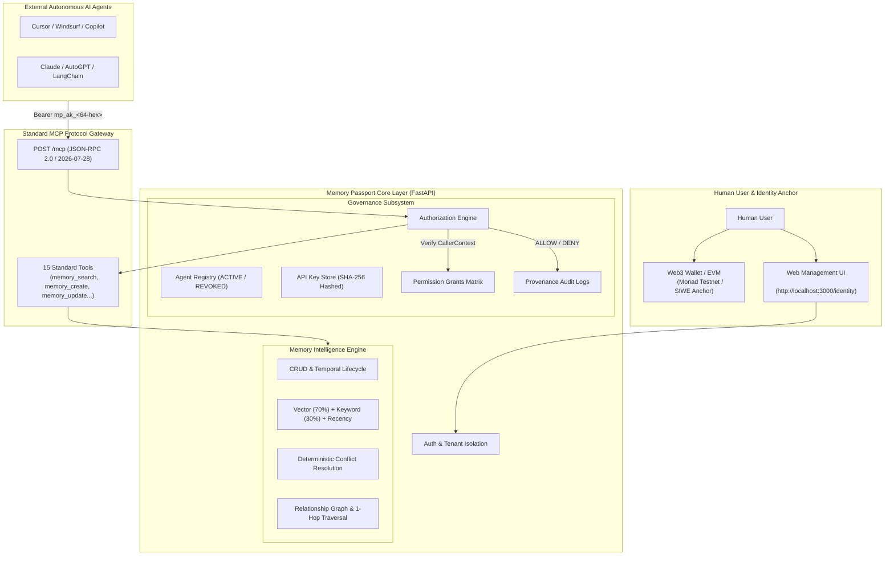

# Memory Passport
### User-Owned Memory Infrastructure for AI Agents

> **让用户真正拥有 AI Agent 的长期记忆，并通过身份、细粒度权限和标准 MCP 控制 Agent 对记忆的访问。**
> *Give users true ownership over AI Agent long-term memory, governed by identity, fine-grained permission delegation, and standard MCP boundaries.*

[](LICENSE)
[](https://github.com/xiehuaian77-sketch/xiehuaian.de5.net/releases/tag/v1.14.0-hackathon-demo)
[]()
[](https://modelcontextprotocol.io/)
[]()

---

## 1. The Problem

Modern AI agents (Cursor, Claude, Copilot, LangChain, AutoGPT) are becoming autonomous, but their memory architectures are fundamentally broken:
- **Memory Silos**: Every application traps memory in its own proprietary database. When you switch tools, your agent forgets your context, project standards, and personal preferences.
- **Unclear Data Ownership**: Who owns the agent's memory? Today, the LLM platform does. If you leave, you leave your context behind.
- **Excessive Privilege & All-or-Nothing Keys**: To give an agent access, developers typically issue full-privilege API keys or direct database credentials. The agent can read, overwrite, or delete anything.
- **No Safe External Access**: There is no standard, secure protocol for external agents to query a user's memory without compromising security.
- **Impossible Revocation**: If an agent behaves maliciously or goes out of scope, revoking access often means rotating master passwords or breaking other integrated tools.

---

## 2. The Solution: Memory Passport

Memory Passport acts as the **sovereign long-term memory infrastructure** for autonomous AI agents:

1. **User-Owned Sovereign Memory**: Memories belong to the human user, stored in isolated, high-performance vector/relational databases under cryptographic human ownership.
2. **Web3 Identity Anchor**: Primary identity is anchored to the user's Web3 wallet (EVM / Monad Testnet) with SIWE cryptographic verification. *(Note: Memory data itself is stored off-chain for privacy, zero gas, and low latency).*
3. **Independent Agent Identity**: Each AI agent is registered as a first-class entity with an isolated ID (`ag_<32-hex>`) and an independent credential (`mp_ak_...`).
4. **Fine-Grained Permission Delegation**: Users delegate specific capabilities (`READ_MEMORY`, `READ_PREFERENCES`, `CREATE_MEMORY`, `UPDATE_MEMORY`) rather than granting full database access.
5. **Standard Model Context Protocol (MCP) Boundary**: External agents connect via the official MCP specification (`POST /mcp`, JSON-RPC 2.0). Every tool call is intercepted by server-side authorization middleware before execution.
6. **Instant Emergency Kill Switch**: Users can revoke any agent with a single click. The agent is immediately marked `REVOKED`, and all subsequent requests are blocked at the gateway with `HTTP 401`.
7. **Complete Provenance Audit Trail**: Every access attempt (ALLOW/DENY), permission grant, and revocation is recorded with timestamps and tool names—with **zero credential leakage**.

---

## 3. Core Authorization Demo Flow

The zero-trust authorization boundary can be observed in real time across the 8-step lifecycle:

```text
[1/8] Agent Handshake      --> POST /mcp tools/list      --> 200 OK (CallerContext verified)
[2/8] READ_MEMORY          --> POST /mcp memory_search   --> 200 ALLOW (Preferences retrieved)
[3/8] CREATE_MEMORY (Raw)  --> POST /mcp memory_create   --> 403 FORBIDDEN (Blocked: No write grant!)
[4/8] Human Grants Perm    --> POST /api/agents/.../perm --> 201 CREATED (User delegates CREATE_MEMORY)
[5/8] CREATE_MEMORY (Retry)--> POST /mcp memory_create   --> 200 ALLOW (Memory persisted with UUID)
[6/8] UPDATE_MEMORY        --> POST /mcp memory_update   --> 403 DENY -> Grant -> 200 ALLOW
[7/8] Emergency Revoke     --> POST /api/agents/.../revoke-> 200 OK (Kill switch engaged)
[8/8] Access After Revoke  --> POST /mcp memory_search   --> 401 UNAUTHORIZED (Instantly terminated)
```

---

## 4. Architecture



---

## 5. Quick Start (One Command)

To launch the complete Hackathon demonstration environment:

```bash
python scripts/start_demo.py
```

### What happens automatically:
1. Validates Python (3.10+), Node.js, and npm runtime environments.
2. Boots the FastAPI backend on `http://127.0.0.1:8000` and validates `/health`.
3. Boots Next.js on `http://localhost:3000` and waits for compilation.
4. Seeds the database with demo user (`demo@memorypassport.ai`), 10 memory items, 5 relationships, and an active `Demo Research Assistant` with `READ_MEMORY`.
5. Probes the MCP gateway on `http://127.0.0.1:8000/mcp` (15 tools ready).
6. Press `Ctrl+C` at any time to gracefully terminate both services with zero orphaned processes.

---

## 6. Live Interactive Demo

### A. Human Governance Console
Open your browser to:
👉 **[http://localhost:3000/identity](http://localhost:3000/identity)**
*(Login: `demo@memorypassport.ai` / `demo123456`)*

- View your **Sovereign Passport** and Web3 identity anchor.
- Inspect the **AI Agent Access Control Panel**.
- Review agent status (`ACTIVE`), view delegated permissions (`READ_MEMORY`), and test the emergency **Revoke Agent** red button.

### B. Live Real HTTP Agent Demo
In a second terminal, execute the real HTTP MCP authorization flow:

```bash
python scripts/demo_agent_mcp_auth.py
```

Witness the full 8-step live cycle execute over real HTTP JSON-RPC 2.0 protocol calls with zero simulation or mocking.

---

## 7. Security Architecture

- **Hashed Credentials**: Agent API keys (`mp_ak_...`) are hashed using SHA-256 before persistence. Raw keys are never stored in the database.
- **Server-Side Enforcement**: Authorization checks occur on the server before tool execution. Client agents cannot tamper with or bypass policies.
- **Least Privilege Default**: Newly registered agents receive zero default permissions until explicitly delegated by the user.
- **Zero Credential Leakage**: Logs, error messages, and audit trails automatically mask all API keys (`mp_ak_8f3f...46e9`) and JWT tokens.
- **Protected Human Core**: High-risk operations (user account deletion, password resets, raw database SQL execution, bulk data export) are **strictly isolated from MCP** and can never be invoked by agents.

---

## 8. Test Verification & Code Quality

The system is rigorously covered by automated regression suites:

- **Backend Pytest Suite**: `645 passed, 4 skipped, 0 failed`
- **Launcher & Demo CLI Tests**: `16 passed, 0 failed`
- **Code Quality (Ruff)**: `0 errors` (`ruff check --config backend/ruff.toml`)
- **TypeScript Typecheck**: `0 errors` (`tsc --noEmit`)
- **Production Next.js Build**: `10/10 static & dynamic routes compiled successfully`

---

## 9. Documentation Index

- 📖 **[Hackathon Live Demo Guide](docs/HACKATHON_DEMO.md)**: 30-second pitch, setup instructions, and troubleshooting matrix.
- 🏗️ **[System Architecture](docs/ARCHITECTURE.md)**: Detailed component breakdown, data flow, and permission model.
- 🎙️ **[3–5 Minute Presentation Script](docs/DEMO_SCRIPT.md)**: Spoken-word presentation script with exact timing for judges.
- 📊 **[System Capabilities & Feature Matrix](docs/CAPABILITIES.md)**: Exhaustive list of all implemented features across Memory, AI, Web3, MCP, and Governance subsystems.

---

## 10. Release Notes

### Version: `v1.14.0-hackathon-demo`
- **Release Purpose**: Hackathon-ready demonstration packaging, one-command launcher, live HTTP authorization script, and complete presentation documentation.
- **Baseline Preservation**: `v1.13.0-autonomous-agent-demo` core business logic, database models, and security boundaries remain **100% untouched**.

---

## License

MIT License — see [LICENSE](LICENSE) for details.
