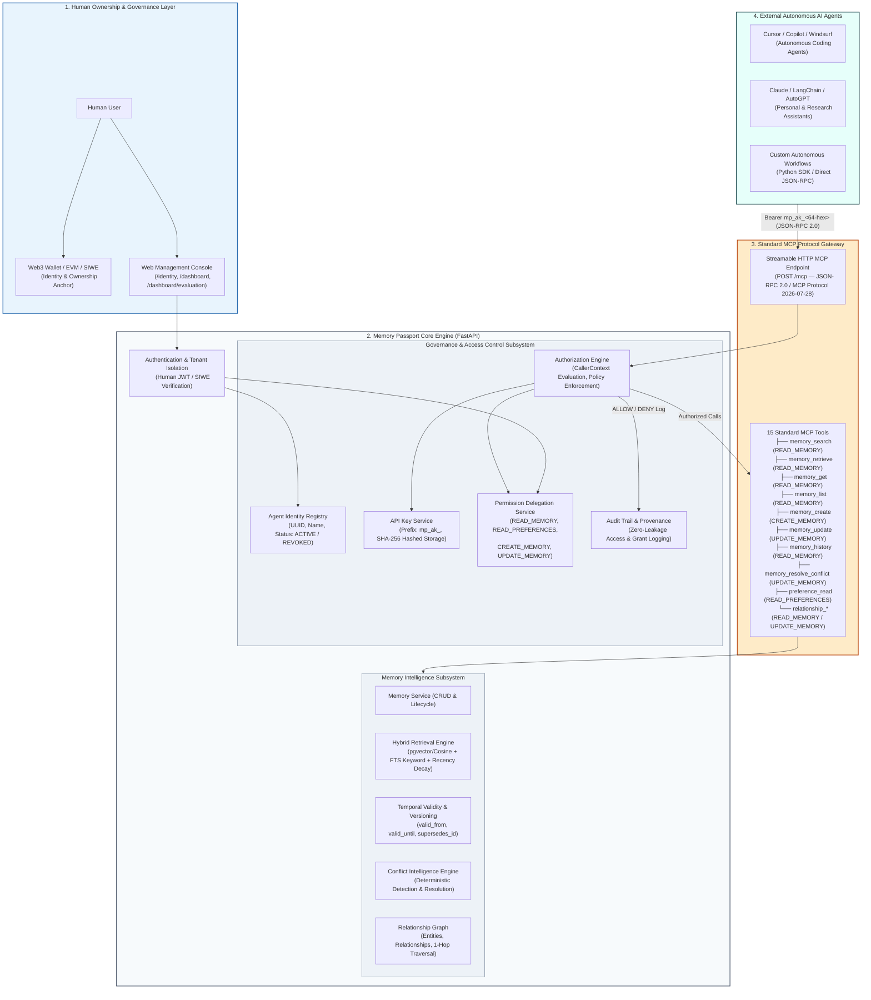

# Memory Passport — System Architecture

**Release Version:** `v1.14.0-hackathon-demo`
**System Classification:** User-Owned Long-Term Memory Infrastructure for Autonomous AI Agents
**Core Purpose:** Sovereign, verifiable, and observable persistent memory governed by human identity, fine-grained permission delegation, and standard Model Context Protocol (MCP) boundaries.

---

## 1. High-Level Architecture Diagram



---

## 2. Architectural Principles & Key Distinctions

### A. Web3 Identity Anchor vs. Data Storage
- **Identity & Ownership Anchor**: Web3 wallets (EVM / Monad Testnet / SIWE) serve as cryptographic proof of human identity and root ownership of the passport.
- **Off-Chain Sovereign Storage**: **Memory data is NOT stored on-chain**. User memories contain rich, evolving personal context, embeddings, and relationships. Persisting them on public blockchains would create severe privacy leaks and astronomical gas costs. Memory Passport stores memories in high-performance local/cloud vector-relational databases (PostgreSQL/pgvector or SQLite) strictly isolated by tenant UUIDs.

### B. Autonomous Agent Identity Isolation
- Agents are registered as first-class subordinate entities bound to a human user.
- Each agent receives a unique `agent_id` (`ag_<32-hex>`) and a distinct Bearer credential with prefix `mp_ak_`.
- **Zero Raw Key Storage**: Only the SHA-256 hash of the API key is persisted.
- **No Shared Passwords / JWTs**: External agents are never given human session JWTs or database connection strings.

### C. Principle of Least Privilege & Fine-Grained Delegation
Instead of all-or-nothing access, Memory Passport enforces a strict capability matrix:

| Permission String | Scope Description | Associated MCP Tools |
| :--- | :--- | :--- |
| `READ_MEMORY` | Read-only search, retrieval, item get, history, graph query | `memory_search`, `memory_retrieve`, `memory_get`, `memory_list`, `memory_history`, `relationship_traverse`, etc. |
| `READ_PREFERENCES` | Read structured preferences and system instructions | `preference_read` |
| `CREATE_MEMORY` | Persist new episodic or semantic memories | `memory_create`, `memory_create_batch` |
| `UPDATE_MEMORY` | Update existing memory contents, resolve conflicts | `memory_update`, `memory_resolve_conflict`, `relationship_create`, `relationship_delete` |

### D. Standard MCP Access Boundary
- All agent interactions occur over the standard **Model Context Protocol** (`POST /mcp`), adhering to the `2026-07-28` specification.
- The MCP server parses incoming requests into a typed `CallerContext`:
  ```python
  CallerContext(
      user_id="...",
      is_agent=True,
      agent_id="ag_...",
      permissions={"READ_MEMORY", "CREATE_MEMORY"}
  )
  ```
- Tool execution is intercepted: if `tool_permission_map[tool_name]` is not contained in `context.permissions`, execution immediately halts with **`HTTP 403 Forbidden`**.

### E. Instant Emergency Kill Switch (Revocation)
- When a human user executes an agent revocation:
  1. The agent record status transitions to `REVOKED` in the database.
  2. All active permission grants are revoked.
  3. Every subsequent MCP call from that agent fails immediately at the authentication barrier with **`HTTP 401 Unauthorized`**.
- Revocation takes effect instantly across all connections without restarting services or rotating user passwords.

### F. Complete Provenance & Audit Trail
- Every access attempt (whether `ALLOW` or `DENY`), permission delegation, permission revocation, and agent revocation is logged in `agent_audit_logs`.
- Logs record timestamps, actor IDs, tool names, parameters, and enforcement results.
- **Zero Credential Leakage**: Raw API keys, JWT tokens, and sensitive cryptographic secrets are strictly excluded from audit logs.

---

## 3. Operations Prohibited for Agents

To protect human user sovereignty, the following operations are strictly **prohibited** for external AI agents and cannot be authorized through any permission grant:
1. **Direct Database Access**: Agents cannot execute arbitrary SQL queries or bypass the repository layer.
2. **User Account Administration**: Agents cannot modify user passwords, delete user accounts, or alter Web3 wallet bindings.
3. **Bulk Memory Purge**: Agents cannot wipe user memory databases or truncate tables.
4. **Agent Self-Privilege Escalation**: Agents cannot create permissions for themselves or grant privileges to other agents.
5. **System Configuration Access**: Agents cannot access system environment variables, LLM provider API keys, or master encryption keys.
